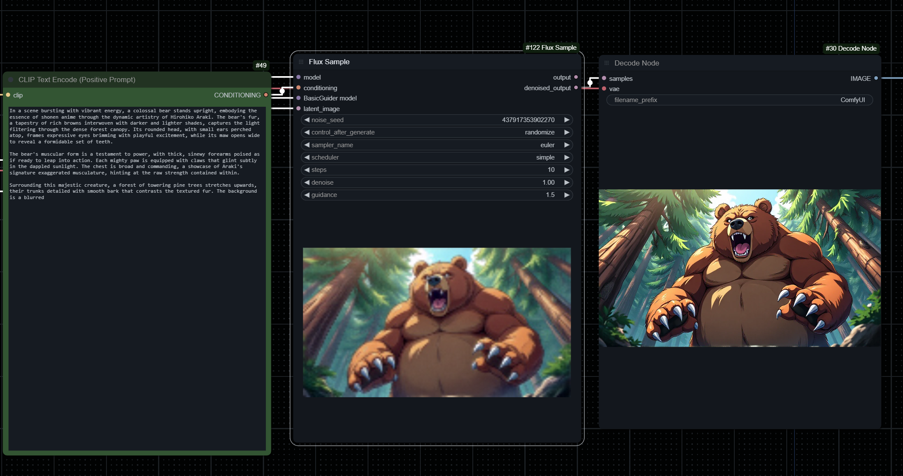

# Art Style Fusion Prompt Engineering


## Overview

Art Style Fusion Prompt Engineering is a versatile Gradio-based application that allows users to create rich, detailed prompts by combining various art styles, image descriptions, and artist inspirations. It is particularly useful for artists, writers, and AI enthusiasts looking to generate creative content with detailed prompts suitable for text to image generators that use T5 text encoders such as Flux but can further convert prompts into Adobe and Stable Diffusion-compatible (SDXL) format.

It uses OpenAI or OpenRouter (or a mix of both) to access both text and image-based AI models, providing a seamless experience for generating prompts. OpenRouter allows for more uncensored and experimental prompts, while OpenAI provides a more controlled and curated experience with a better vision model.

Futher adaptations will be made to use Claude and Ollama but this was so sucessful and cost effective that it was decided to keep it as is for now.

## Installation

You can install the required dependencies using either `pip` or `conda`.

### Using pip and Python Virtual Environment

1. Clone the repository:
   ```bash
   git clone https://github.com/ergonomech/Art-Style-Fusion-Prompt-Enginner.git
   cd Art-Style-Fusion-Prompt-Engineering
   ```

2. Create a virtual environment:
   ```bash
   python -m venv env
   ```

3. Activate the virtual environment:

   - On Windows:
     ```bash
     .\env\Scripts\activate
     ```
   - On macOS and Linux:
     ```bash
     source env/bin/activate
     ```

4. Install the required packages:
   ```bash
   pip install gradio requests pillow python-dotenv
   ```

### Using Conda (recommnended)

0. Make sure you have Conda installed. If not, you can download it from [here](https://docs.conda.io/en/latest/miniconda.html).

1. Clone the repository:
   ```bash
   git clone https://github.com/ergonomech/Art-Style-Fusion-Prompt-Enginner.git
   cd Art-Style-Fusion-Prompt-Engineering
   ```

2. Create a new Conda environment and install dependencies:
   ```bash
   conda create --name art-style-fusion python=3.10 requests pillow python-dotenv conda-forge::gradio
   conda activate art-style-fusion
   ```

## Usage

1. Make sure you have the necessary API keys and configuration details. Update the `.env` file with your OpenAI and OpenRouter API keys. These variables can also be loaded from your operating system environment variables as priority.

2. Start the application by running:
   ```bash
   python gradio-app.py
   ```

3. Open your web browser and navigate to the URL provided (default is `http://127.0.0.1:7633`).

4. Use the UI to configure your inputs, upload images, select art styles, and generate prompts.

## Features

- **Art Style Selection**: Choose from a variety of art styles and get detailed descriptions.
  

- **Image Analysis**: Upload an image or input a description to get a detailed analysis.
  

- **Artist Recommendation**: Get suggestions for artists whose style matches the chosen art and image elements.
  

- **Prompt Generation**: Combine the selected style, image description, and artist suggestion into a cohesive prompt.
  
  

- **Stable Diffusion Conversion**: Convert prompts into Stable Diffusion-compatible format for further use.
  
  

## Credits

- **Gradio**: Provides the interface for this application. Learn more at [Gradio's official site](https://www.gradio.app).
- **PIL (Pillow)**: Used for image processing. Learn more at [Pillow's official site](https://python-pillow.org/).
- **requests**: Handles API calls to OpenAI and OpenRouter.
- **dotenv**: Manages environment variables for flexible configuration.

## Contributing

Feel free to contribute to this project by opening issues or submitting pull requests. All contributions are welcome!

## License

This project is licensed under the MIT License. See the `LICENSE` file for more details.
